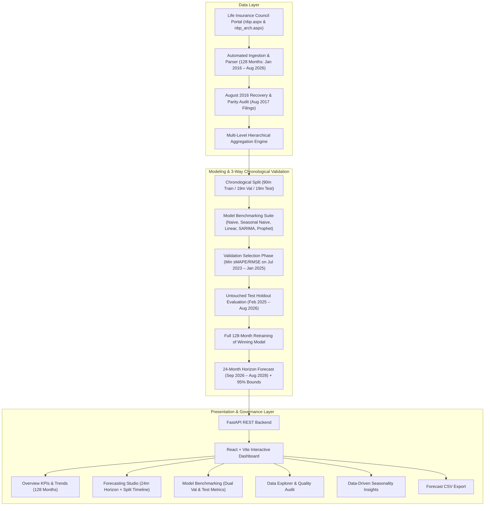

# Insurance Intelligence: Life Insurance New Business Forecasting Platform

[](https://fastapi.tiangolo.com)
[](https://react.dev)
[](https://tailwindcss.com)
[](https://python.org)
[](LICENSE)

An end-to-end, production-grade AI/ML Forecasting Platform for Life Insurance New Business Premium and Policy volumes. Powered by **128 authentic historical monthly observations (January 2016 – August 2026)** ingested directly from the Life Insurance Council portal (`nbp.aspx` and `nbp_arch.aspx`), this platform implements a strict **3-way chronological time series split (90m Train / 19m Validation / 19m Untouched Test)**, full 128-month model retraining, and an out-of-sample **24-month forecasting horizon (September 2026 – August 2028)** with 95% confidence intervals.

---

## 1. System Architecture



---

## 2. Key Features

- **Authentic Regulatory Historical Dataset**:
  - Spans **128 continuous monthly observations** from **January 2016 to August 2026** (19,411 individual records across 28 life insurers and 5 product lines).
  - 127 months directly downloaded from official HTML archives; August 2016 recovered from official August 2017 filings' prior-year comparison with verified mathematical parity (reported Grand Total matches sum of insurers to within ₹0.01 Cr).
  - Zero synthetic, simulated, or fake data used in model fitting or projections.
- **Strict 3-Way Chronological Time Series Partitioning**:
  - **Training Window (90 months: Jan 2016 – Jun 2023, ~70.3%)**: Used for initial model parameter estimation.
  - **Validation Window (19 months: Jul 2023 – Jan 2025, ~14.8%)**: Drives model selection strictly via lowest validation sMAPE/RMSE.
  - **Untouched Test Holdout (19 months: Feb 2025 – Aug 2026, ~14.8%)**: Kept completely isolated during model selection; evaluated post-selection to verify unbiased out-of-sample generalization.
  - **Full Retraining (128 months)**: The winning architecture is retrained on 100% of historical actuals prior to projecting the future forecast.
- **24-Month Production Forecast Horizon**:
  - Projects monthly point forecasts and 95% confidence intervals from **September 2026 through August 2028**.
- **Multi-Level Hierarchical Forecasting**:
  - **Industry Level**: Entire Indian Life Insurance market rollup.
  - **Insurer Level**: Individual insurers (LIC of India, HDFC Life, SBI Life, ICICI Prudential, Max Life, etc.).
  - **Category Level**: Specific IRDAI product categories (Individual Single, Individual Non-Single, Group Single, Group Non-Single, Group Yearly Renewable).
  - **Insurer + Category**: Granular cross-segment combinations.
- **Dual Target Variables**:
  - **New Business Premium**: Displayed in `₹ Crore`.
  - **Number of Policies**: Displayed in integer policy counts.
- **5 Diverse Forecasting Architectures**:
  - Naive Baseline (last-observed persistence).
  - Seasonal Naive (12-month annual cyclical lag).
  - Feature-Engineered Linear Regression (polynomial trend $t, t^2$, sinusoidal annual harmonics, March fiscal-year-end surge indicator).
  - SARIMA / SARIMAX (seasonal autoregressive integrated moving average).
  - Prophet / Holt-Winters Exponential Smoothing.
- **Comprehensive Evaluation & Benchmarking**:
  - Dual reporting of both Validation (Selection) and Untouched Test (Holdout) metrics: MAE, RMSE, sMAPE, and MAPE.
  - Interactive comparison tables and side-by-side bar charts illustrating the generalization gap.
- **Interactive Dashboard & Governance**:
  - Dynamic interactive Recharts visualizer with 95% confidence intervals and historical-to-forecast vertical boundary.
  - Split timeline cards explaining data partitioning.
  - Automated descriptive seasonality profiling (highlighting March tax-season peaks and April troughs).
  - One-click CSV export of forecasted periods with prediction bounds.

---

## 3. Technology Stack

- **Backend**:
  - Python 3.12+
  - FastAPI (REST APIs with auto-generated Swagger UI)
  - Uvicorn (ASGI web server)
  - Pandas, NumPy (Data processing & vectorization)
  - Scikit-learn (Ridge regression & feature modeling)
  - Statsmodels (SARIMAX, ARIMA, Holt-Winters Exponential Smoothing)
  - Pydantic v2 (Request/response schemas & validation)
  - Pytest (Automated testing suite)
- **Frontend**:
  - React 18
  - Vite (Fast development & production bundler)
  - Tailwind CSS v3 (Responsive glassmorphism dashboard)
  - Recharts (Interactive SVG charting)
  - Axios (HTTP client with timeout handling)
  - Lucide React (Icons)

---

## 4. Project Structure

```
insurance-forecasting-platform/
├── backend/
│   ├── app/
│   │   ├── main.py                    # FastAPI application entrypoint
│   │   ├── config.py                  # Global configurations & paths
│   │   ├── schemas.py                 # Pydantic v2 data models
│   │   ├── api/
│   │   │   ├── routes_health.py       # Health check endpoint
│   │   │   ├── routes_data.py         # Summary, metadata, historical query, upload
│   │   │   ├── routes_forecast.py     # Forecast generation, comparison, export
│   │   │   └── routes_analytics.py    # Industry trends, rankings, insights
│   │   ├── services/
│   │   │   ├── data_service.py        # Dataset lifecycle & caching
│   │   │   ├── preprocessing_service.py # Date parsing, cleaning, dedup, aggregate masking
│   │   │   ├── aggregation_service.py # 4-level hierarchical rollup logic
│   │   │   ├── forecasting_service.py # Pipeline coordination & model fitting
│   │   │   ├── evaluation_service.py  # Chronological holdout benchmark & metrics
│   │   │   ├── analytics_service.py   # Trend aggregation & descriptive insights
│   │   │   └── export_service.py      # CSV export formatter
│   │   ├── models/
│   │   │   ├── base.py                # Abstract BaseForecaster interface
│   │   │   ├── naive.py               # Naive forecaster
│   │   │   ├── seasonal_naive.py      # Seasonal Naive forecaster
│   │   │   ├── linear_regression.py   # Feature-engineered Ridge regression
│   │   │   ├── sarima_model.py        # Statsmodels SARIMA forecaster
│   │   │   └── prophet_model.py       # Prophet / Holt-Winters fallback forecaster
│   │   └── utils/
│   │       ├── date_utils.py          # Date manipulation & ISO generator
│   │       └── logger.py              # Structured logging
│   └── requirements.txt
├── frontend/
│   ├── src/
│   │   ├── components/
│   │   │   ├── Navbar.jsx             # Top branding & tab navigation
│   │   │   ├── StatCard.jsx           # Reusable KPI card
│   │   │   ├── ForecastControls.jsx   # Forecasting configuration panel
│   │   │   ├── ForecastChart.jsx      # Recharts historical + forecast + bounds
│   │   │   ├── ComparisonTable.jsx    # Model benchmarking comparison table
│   │   │   └── FileUploadDropzone.jsx # Drag-and-drop custom CSV uploader
│   │   ├── pages/
│   │   │   ├── OverviewPage.jsx       # Executive summary & trend charts
│   │   │   ├── ForecastPage.jsx       # Forecasting studio & table
│   │   │   ├── ModelComparisonPage.jsx# Multi-model evaluation benchmark
│   │   │   ├── DataExplorerPage.jsx   # Data browser, audit card & upload
│   │   │   └── InsightsPage.jsx       # Automated descriptive insights
│   │   ├── services/
│   │   │   └── api.js                 # Axios API connector
│   │   ├── App.jsx                    # Root component
│   │   └── index.css                  # Tailwind styles & theme
│   ├── package.json
│   ├── vite.config.js
│   └── tailwind.config.js
├── data/
│   ├── raw/
│   │   └── life_insurance_new_business_data.csv # Authentic IRDAI benchmark dataset
│   └── processed/
├── docs/
│   └── ml_pipeline_explained.md       # In-depth ML mathematics & architecture
├── tests/
│   ├── test_preprocessing.py          # Date parsing, numeric cleaning, dedup tests
│   ├── test_aggregation.py            # 4-level aggregation & anti-double-counting tests
│   ├── test_forecasting.py            # Forecasting models & metric computation tests
│   └── test_api.py                    # FastAPI endpoint integration tests
├── pytest.ini
├── run_project.bat                    # Windows 1-click startup script
├── run_project.sh                     # Linux/macOS startup script
└── README.md
```

---

## 5. Quick Start & Installation

### Prerequisites
- Python 3.10+ (Tested on Python 3.12)
- Node.js 18+ and npm

### 1. Clone & Set Up Backend

```bash
# Create Python virtual environment
python -m venv .venv

# Activate virtual environment
# Windows:
.venv\Scripts\activate
# Linux/macOS:
source .venv/bin/activate

# Install backend dependencies
pip install -r backend/requirements.txt

# Run benchmark dataset generator (if raw dataset is not already present)
python scripts/generate_benchmark_data.py
```

### 2. Set Up Frontend

```bash
cd frontend
npm install
cd ..
```

### 3. Launch Application

#### Option A: Script (Recommended)
- **macOS / Linux**: `./run_project.sh`
- **Windows**: `run_project.bat`

#### Option B: Manual Command Line
In Terminal 1 (Backend):
- **macOS / Linux**:
  ```bash
  source .venv/bin/activate
  uvicorn backend.app.main:app --host 127.0.0.1 --port 8000 --reload
  ```
  *(Or without activating: `.venv/bin/python -m uvicorn backend.app.main:app --host 127.0.0.1 --port 8000 --reload`)*

- **Windows**:
  ```cmd
  .venv\Scripts\python -m uvicorn backend.app.main:app --host 127.0.0.1 --port 8000 --reload
  ```

In Terminal 2 (Frontend):
```bash
cd frontend
npm run dev -- --host 127.0.0.1 --port 5173
```

- **Frontend Dashboard**: `http://127.0.0.1:5173/`
- **Backend API & Swagger Docs**: `http://127.0.0.1:8000/docs`

---

## 6. Automated Testing

The backend includes a comprehensive suite of 25 automated tests covering data parsing, numeric cleaning, aggregation levels, all 5 forecasting models, 3-way chronological holdout splits (90/19/19), non-leakage validation, and API endpoints.

To run tests:
- **macOS / Linux**: pytest -v tests  *(or `.venv/bin/pytest -v tests`)*
- **Windows**: `.venv\Scripts\pytest -v tests`


Output:
```
============================= 25 passed in 9.86s ==============================
```

---

## 7. API Reference

### Health Check
- `GET /api/health`
  - Returns operational status, loaded record count, and active data source.

### Data Management
- `GET /api/data/summary`: Returns row/column counts, date range, number of insurers/categories, and data quality report.
- `GET /api/data/metadata`: Returns available insurers, categories, forecasting levels, targets, and horizons.
- `GET /api/data/historical?level=industry&target=premium_month_cr`: Returns monthly historical time series.
- `POST /api/data/upload`: Multipart CSV file upload for custom datasets with live schema detection.

### Forecasting
- `POST /api/forecast`
  - Request:
    ```json
    {
      "level": "industry",
      "target": "premium_month_cr",
      "horizon": 12,
      "selected_model": "auto"
    }
    ```
  - Response:
    ```json
    {
      "level": "industry",
      "target": "premium_month_cr",
      "target_unit": "₹ Crore",
      "horizon": 12,
      "selected_model": "SARIMA",
      "recommended_model": "SARIMA",
      "model_selection_reason": "Selected 'SARIMA' based on superior holdout accuracy with lowest sMAPE (4.12%) and RMSE (1240.50)...",
      "historical_data": [...],
      "forecast_data": [
        {
          "date": "2024-04-01",
          "display_date": "Apr 2024",
          "point_forecast": 18240.50,
          "lower_bound": 16120.30,
          "upper_bound": 20360.70,
          "is_forecast": true
        }
      ],
      "evaluation_metrics": [...]
    }
    ```

- `POST /api/forecast/compare`
  - Compares all models on chronological holdout and returns validation metrics (MAE, RMSE, MAPE, sMAPE, WAPE).

- `POST /api/export/forecast`
  - Downloads forecast results and 95% confidence bounds as a CSV file.

### Analytics
- `GET /api/analytics/trends`
  - Returns industry monthly trends, YoY/MoM growth, top insurers rankings, product category share, calendar seasonality, and descriptive insights.

---

## 8. Limitations & Future Roadmap

1. **Macro-economic Regressors (SARIMAX)**: While SARIMA is supported, future iterations can incorporate exogenous predictors such as GDP growth, interest rate shifts, and equity market indices.
2. **Hierarchical Reconciliation (MinT / Bottom-Up)**: Currently, models are fitted at the chosen aggregation level. Implementing Optimal Reconciliation (e.g. MinT) would guarantee mathematical coherence across all hierarchies simultaneously.
3. **Automated Retraining Cron**: Recurring automated retraining pipelines upon receipt of new monthly regulatory data filings.

---

## 9. License

This project is licensed under the MIT License.
