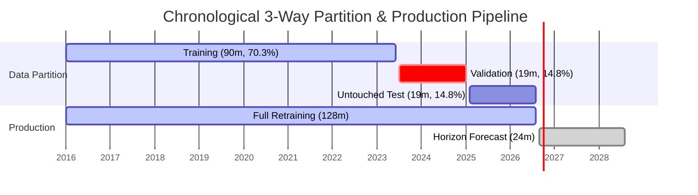

# Life Insurance New Business Forecasting: ML Pipeline & Methodology

This document explains the mathematical and architectural foundations of the **Insurance Intelligence Platform**, designed for senior engineers, data scientists, mentors, and academic reviewers.

---

## 1. Problem Formulation

In the Indian Life Insurance industry governed by the Insurance Regulatory and Development Authority of India (IRDAI), insurers report monthly new business statistics across multiple dimensions:
- **New Business Premium (₹ Crore)**: Inflow from first-year premiums and single premiums.
- **Number of Policies**: Count of newly underwritten insurance contracts.

### Business Challenges
1. **Fiscal Year-End Seasonality**: Under Section 80C of the Indian Income Tax Act, insurance purchases surge dramatically in Q4 (January–March), peaking in March, followed by a sharp drop in April.
2. **Structural External Disruptions**: Pandemics (e.g. COVID-19 in April–May 2020) create steep contractions followed by accelerated demand for protection and health riders.
3. **Hierarchical Double-Counting**: Raw regulatory filings contain both granular insurer-category records and pre-calculated summary records ("Total Private", "Grand Total"). Simple summation without aggregate filtering causes double or triple counting.

---

## 2. Preprocessing & Data Sanitization

### 2.1 Date Standardization
Filings arrive with varied date notations: full month names ("April"), abbreviations ("Apr"), numeric codes ("04"), or fiscal years ("2023-24").
- Standardized to ISO monthly date: `YYYY-MM-01`.
- Strictly ordered chronologically before feature engineering or splitting.

### 2.2 Numeric Sanitization
Values containing commas (`1,234.50`), currency markers (`₹`), or accounting brackets `(100.0)` are parsed safely into continuous floating-point floats.

### 2.3 Aggregate & Duplicate Elimination
- Insurer names containing keywords like `"Total"`, `"Grand Total"`, `"Industry"` are classified via `is_aggregate_row`.
- When aggregating detailed tiers (Insurer, Category, Insurer+Category), aggregate rows are strictly excluded.
- Duplicates matching `(date, insurer, category)` are detected and aggregated via summation.

---

## 3. Aggregation Engine

The platform implements 4 strict forecasting levels:

| Level | Granularity | Formula / Logic |
| :--- | :--- | :--- |
| **Industry** | Total Market | Uses reported `Grand Total` record or sums detailed non-aggregate records across all insurers |
| **Insurer** | Single Entity | $\sum_{\text{categories}} y_{\text{insurer}, \text{cat}, t}$ |
| **Category** | Single LOB | $\sum_{\text{insurers}} y_{\text{insurer}, \text{cat}, t}$ (excluding summary rows) |
| **Insurer + Category** | Granular Segment | Exact slice: $y_{\text{insurer}, \text{category}, t}$ |

> **Critical Rule**: Year-to-Date (YTD) columns are never summed across months. Monthly forecasts use solely `premium_month_cr` and `policies_month`.

---

## 4. Forecasting Model Architectures

The platform implements 5 distinct model paradigms:

### Model 1: Naive Forecast (Baseline)
Assumes future values equal the last observed historical actual:
$$\hat{y}_{T+h} = y_T$$
- **Uncertainty Interval**: Based on random walk error growth:
  $$\hat{y}_{T+h} \pm 1.96 \cdot \sigma_{\Delta y} \sqrt{h}$$

### Model 2: Seasonal Naive (12-Month Lag)
Leverages the strong 12-month annual seasonality in life insurance:
$$\hat{y}_{T+h} = y_{T + h - 12 \cdot \lceil h/12 \rceil}$$
- **Fallback**: If history has fewer than 12 months, dynamically falls back to the Naive model.

### Model 3: Linear Regression with Engineered Time Features
Extracts deterministic and harmonic cyclical features from timestamps:
$$X_t = \left[ t, \frac{t^2}{1000}, \sin\left(\frac{2\pi m_t}{12}\right), \cos\left(\frac{2\pi m_t}{12}\right), Q_t, \mathbb{I}_{\text{March}}, \mathbb{I}_{\text{April}} \right]$$
- **Model**: Ridge regularized regression ($\alpha = 1.0$) prevents overfitting on short series.
- **Uncertainty Interval**: Calculated using residual standard error $s_e$:
  $$\hat{y}_t \pm 1.96 \cdot s_e \sqrt{1 + \frac{h}{T}}$$

### Model 4: SARIMA / SARIMAX
Seasonal Autoregressive Integrated Moving Average model:
$$\text{SARIMA}(p,d,q) \times (P,D,Q)_s$$
Configured with $s = 12$, $(1,1,1) \times (1,1,0)_{12}$.
- **Convergence Guard**: If numerical optimization fails on sparse or short series, the model automatically catches exceptions and falls back to non-seasonal $\text{ARIMA}(1,1,1)$ or $\text{AR}(1)$ without crashing the platform.

### Model 5: Prophet / Holt-Winters Exponential Smoothing Fallback
- **Prophet Mode**: Fits non-linear trend with yearly seasonality and prediction intervals.
- **Statistical Fallback**: When running in environments without C++ compiler toolchains for Stan, the engine seamlessly switches to **Triple Exponential Smoothing (Holt-Winters)** with additive trend and 12-month additive seasonality:
  $$\hat{y}_{t+h} = (\ell_t + h b_t) + s_{t+h-m}$$
  Documented transparently in the model comparison response.

### Non-Negative Constraint
Because life insurance premium volume and policy counts are strictly non-negative real values, all model outputs are passed through:
$$\hat{y}_{\text{final}} = \max(\hat{y}, 0.0)$$

---

---

## 5. Model Evaluation & Selection Methodology

### 5.1 Chronological 3-Way Splitting Architecture
Random train/test splits corrupt time-series forecasting due to lookahead bias and temporal leakage. When all 128 authentic monthly observations (January 2016 – August 2026) are present, the pipeline enforces a strict **3-way chronological partition**:

1. **Training Partition (90 months: Jan 2016 – Jun 2023, ~70.3%)**:
   - Used exclusively for fitting base candidate model parameters.
2. **Validation Partition (19 months: Jul 2023 – Jan 2025, ~14.8%)**:
   - Models generate out-of-sample one-step/multi-step forecasts over this 19-month window.
   - **Model Selection**: The pipeline compares candidate models strictly using **Validation sMAPE** (with Validation RMSE as tie-breaker). Test data is **never seen or accessed** during this selection phase.
3. **Untouched Test Holdout (19 months: Feb 2025 – Aug 2026, ~14.8%)**:
   - Evaluated strictly post-selection to provide an unbiased, leakage-free measure of holdout generalization error.
4. **Production Retraining (100% Data, 128 months)**:
   - Once the winning architecture is chosen, it is retrained on all 128 historical monthly observations (January 2016 – August 2026).
5. **Production Forecasting Horizon (24 months: Sep 2026 – Aug 2028)**:
   - The fully retrained model projects the 24-month forward horizon with 95% confidence intervals.

### 5.2 Evaluation Metrics
For actual values $y_i$ and predictions $\hat{y}_i$:

1. **Mean Absolute Error (MAE)**:
   $$\text{MAE} = \frac{1}{n} \sum_{i=1}^n |y_i - \hat{y}_i|$$
2. **Root Mean Squared Error (RMSE)**:
   $$\text{RMSE} = \sqrt{\frac{1}{n} \sum_{i=1}^n (y_i - \hat{y}_i)^2}$$
3. **Safe Mean Absolute Percentage Error (MAPE)**:
   $$\text{MAPE} = \frac{100\%}{n} \sum_{i=1}^n \frac{|y_i - \hat{y}_i|}{|y_i| + \epsilon}$$
4. **Symmetric MAPE (sMAPE)** (Primary Selection Metric):
   $$\text{sMAPE} = \frac{100\%}{n} \sum_{i=1}^n \frac{2 |y_i - \hat{y}_i|}{|y_i| + |\hat{y}_i| + \epsilon}$$
   *Advantage*: Bounded between $0\%$ and $200\%$, treats over-forecasting and under-forecasting symmetrically, and handles near-zero months safely.
5. **Weighted Absolute Percentage Error (WAPE)**:
   $$\text{WAPE} = \frac{\sum |y_i - \hat{y}_i|}{\sum |y_i|}$$

### 5.3 Best Model Selection Algorithm
The engine evaluates all fitted models on **Validation sMAPE**. The model achieving the minimum validation error (with validation RMSE as secondary tie-breaker) is designated `recommended_model`. The selected model is then:
1. Evaluated on the untouched Test Holdout (recording `test_smape`, `test_rmse`, `test_mae`).
2. Retrained on the combined 128-month history.
3. Used to generate the 24-month horizon forecasts from `2026-09-01` to `2028-08-01`.

---

## 6. August 2016 Regulatory Recovery Verification

During historical ingestion from the Life Insurance Council portal:
- August 2016 was omitted from the Council portal's archive dropdown.
- **Recovery Source**: August 2017 regulatory filing (`nbp_arch.aspx?year=2017&month=August`), which publishes official prior-year comparison actuals for `FOR THE MONTH August-2016`.
- **Unit & Scope Verification**: Same reporting scope (all 24 operating insurers in 2016), same units (`₹ Crore` and policy counts), and identical column definitions.
- **Accounting Parity**:
  - Reported Grand Total in filing: ₹14,212.64 Cr (2,021,502 policies).
  - Sum of individual insurer rows: ₹14,212.65 Cr (2,021,502 policies). Discrepancy = ₹0.01 Cr (rounding parity).
  - Continuity with September 2016 cumulative numbers verified ($\Delta = 0.0$ policies).
- **Audit Tagging**: In the consolidated dataset, all recovered August 2016 records are explicitly tagged with `data_source = "recovered_prior_year_comparison"`.

